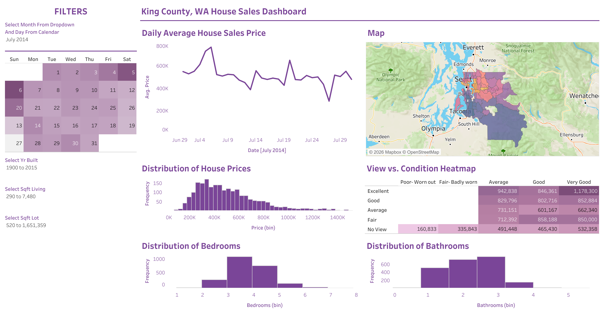

# 🏡 King County House Sales Dashboard (Tableau Project)

## 📌 Project Overview

This project analyzes **21,060 home sales** in **King County, Washington**, the county that includes Seattle. The sales took place between **May 2014 and May 2015** across **70 zip codes**.

I built an interactive Tableau dashboard that shows where homes sell, how prices are spread out, and how features like view, condition, bedrooms, and bathrooms relate to price. Viewers can click a day on the calendar or adjust the sliders, and the whole dashboard updates.

## 🎯 Key Features

✅ Price map: average sale price by zip code across King County 
✅ Sales calendar: average price for each day, laid out by week and weekday 
✅ Price trend: average sale price over time 
✅ Heatmap: average price by home view and condition 
✅ Histograms: distribution of house prices, bedrooms, and bathrooms 
✅ Interactive filters: click-to-filter calendar plus sliders for living area, lot size, and year built 

## 📷 Dashboard Preview

## 🗂️ Repository Files

| File | Description |
|---|---|
| `KingCountyHouseSales_Tableau.twb` | Tableau workbook with all sheets and the dashboard |
| `HouseData.xlsx` | 21,060 home sales with price, size, rooms, condition, view, year built, zip code, and location |
| `KingCountyDashboard.png` | Screenshot of the finished dashboard |

## 🧹 Data Preparation

- **Bins:** created **bins** for price, bedrooms, and bathrooms to build the three histograms
- **Geographic roles:** used **zip code**, **latitude**, and **longitude** to plot sales on a map
- **Date levels:** split the sale date into **week** and **weekday** to build the calendar view
- **Filter action:** set up a **dashboard action** so clicking a day on the calendar filters the other charts
- **Range filters:** added **sliders** for living area (sq ft), lot size (sq ft), and year built

## 🛠️ Skills & Tools Applied

- **Tool:** Tableau Public
- **Calculations:** bins, aggregations, date parts
- **Visualization:** filled map, calendar view, heatmap, line chart, histograms
- **Interactivity:** dashboard filter actions, range sliders
- **Dashboard design:** layout containers, consistent color scale for price

## 📈 Business Questions Answered

This dashboard helps answer the following questions:

- Which zip codes have the highest and lowest home prices?
- How are house prices distributed across the county?
- What are the most common bedroom and bathroom counts?
- How do view and condition affect sale price?
- Which days and months see the most sales?

## 💡 Key Insights

- The median sale price was **$445,000**, and the average was about **$500,000**
- Zip code **98039 (Medina)** had the highest average price at about **$1.15 million**
- Zip code **98002 (Auburn)** had the lowest average price at about **$234,000**
- **3-bedroom** homes were the most common, making up **46%** of sales
- Homes with an **excellent view** averaged about **$907,000**, nearly double the **$478,000** for homes with no view
- Homes in **poor condition** averaged about **$294,000**, compared with **$551,000** for homes in very good condition
- Sales peaked in **spring and summer** and dropped in **winter**, with **January 2015** the slowest full month
- Almost all sales happened on **weekdays**. Only about **2%** closed on a weekend

**Data note:** the highest price in this file is **$1,495,000**, so it looks like more expensive homes were removed from the original dataset. Averages for wealthy zip codes are likely lower than the true market values.

## 🚀 Learning Outcomes

📌 Built histograms with custom bins to show how values are distributed 
📌 Created a calendar view from a single date field 
📌 Mapped data by zip code using Tableau's geographic roles 
📌 Used dashboard filter actions so one click updates every chart 
📌 Learned to check the data range for caps that can shape the results 

## 🙌 Acknowledgment

This project helped me learn maps, bins, calendar views, and dashboard actions in Tableau.

<!-- Optional: add the tutorial name and link here, e.g. "Tutorial by [Name](link)" -->

## 🔗 Related Link

<!-- EDIT: add the LinkedIn post link after publishing -->

## 🧑‍💻 Author

**Omar Shazley** 
💼 [LinkedIn](https://www.linkedin.com/in/omar-shazley-914a16b1/) 
📧 Email: [omarshazley@gmail.com](mailto:omarshazley@gmail.com)

✨ If you like this project, don't forget to ⭐ star the repo!
